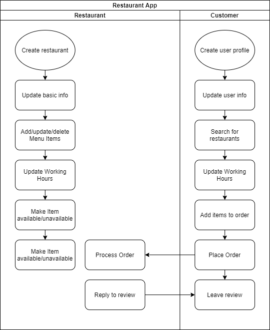
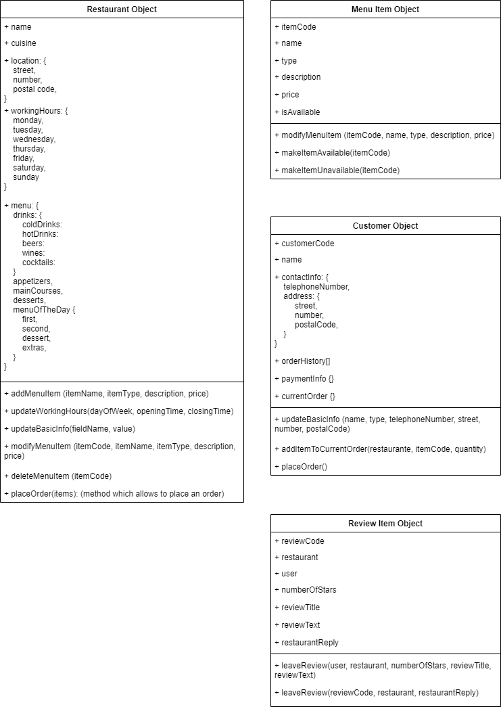

# Pirple Homework #12: Object Oriented Programming

## Applying OOP to a restaurant app

### App Description

A restaurant app which allows restaurants to display their online menus and users to choose from a wide variety of cuisines and price options would benefit greatly from an OOP design approach.
The app would handle easily the more stable data of the restaurants (name, location, type of cuisine, working hours, etc) and also the more dynamic items (menu for the day, prices, current discounts, availability of dishes, current orders, etc)
The process of presenting the customers with all the available options, handling orders and managing reviews would also benefit greatly from an OOP pattern.

### Restaurant manager user story

As a restaurant manager, I want to be able to have all the customer-relevant information of my restaurant online, so I am able to reach as many possible customers as possible. I want to be able to write the more stable pieces of data of my restaurant, suchs name, location or type of cuisine. I also want to be able to write and constantly update the more dynamic pieces of information, such as menu for the day, prices, current discounts, availability of specific menu items and current orders. 

### Restaurant customer user story

As a restaurant customer, I want to be able to access all kinds of restaurants and choose a meal based on cuisine type, price, time the order will take and previous customers' reviews. I want to be able to place an order easily and give a review to the restaurant depending on my experience. I also want to be able to have my most basic information in the app so that I don't have to give my address or phone number every time I place an order.

### Activity Diagram

The following activity diagram shows how the restaurant creates/updates all the information about the restaurant itself and also about the menu items. It shows as well how the customer creates/updates their contact information. The customer interacts with the restaurants first by searching for the available menus and prices, and then places an order to a restaurant. After the experience, the customer is able to leave a review for the restaurant, and the restaurant has the possibility of replying to the review.

### Object Diagram

In the object diagram is possible to see the main objects -with their corresponding keys and methods- which are part of the app. The restaurant object has all the basic information of the restaurant, as well as the menu composition. The restaurant has a few different methods to update their basic information and add/remove items from the menu. They also have a method to make available/unavailable a certain menu item.
This object also includes a method thaty allows the customer to place an order.

The menu item object has all the needed information needed to create and describe a menu item. The customer object contains all the basic contact information of the customer, their payment information, their order history, and an object which handles the current order. Finally, the reviews are stored in the review item object, which includes the text of the review, the user, the restaurant, the number of the stars and the reply of the restaurant.

